# FELO Data Warehouse Star Schema

Dokumen ini mendefinisikan rancangan star schema untuk Data Warehouse FELO. Model ini dipakai untuk analitik lintas layanan FELO-City, FELO-Food, FELO-Send, pembayaran, wallet, matching, feedback, dan fraud/geofencing.

## Prinsip Desain

- Data warehouse tidak menggantikan database OLTP microservices.
- Setiap fact table memiliki grain yang eksplisit.
- Tidak menggunakan satu fact table besar karena grain antar domain berbeda.
- Dimensi dipakai untuk filter, grouping, slicing, dan drill-down.
- Measure hanya berisi angka yang dapat dihitung, dijumlahkan, dirata-ratakan, atau dibandingkan.
- Shared dimensions dipakai agar performa antar layanan bisa dibandingkan secara konsisten.
- Surrogate key dipakai pada dimensi. Natural key dari source system tetap disimpan sebagai referensi.
- User, driver, dan merchant memakai Slowly Changing Dimension Type 2.
- PII seperti email, nomor HP, alamat lengkap, dan identitas pribadi mentah tidak disimpan di DWH analitik.
- Semua timestamp analitik distandarkan ke timezone `Asia/Jakarta`.

## Dimension vs Measure

| Jenis | Fungsi | Contoh Benar | Contoh Salah |
|---|---|---|---|
| Dimension | Filter, grouping, drill-down | `status_key`, `city`, `service_type_key`, `payment_method_key` | `fare_amount` sebagai dimensi |
| Measure | Nilai numerik yang dihitung | `fare_amount`, `distance_km`, `duration_minute`, `is_completed` | `status = completed` sebagai measure |

Status, kota, nama layanan, metode bayar, dan alasan pembatalan adalah dimensi. Amount, durasi, jarak, jumlah, rating, skor risiko, dan flag numerik adalah measure.

## Bus Matrix

| Proses Bisnis | Fact Table | Grain | Dimensi Utama | Measure Utama |
|---|---|---|---|---|
| Perjalanan FELO-City | `fact_trip` | 1 baris = 1 trip/request perjalanan | Date, Time, User, Driver, Service, Pickup Zone, Dropoff Zone, Payment Method, Status, Vehicle | Fare, distance, duration, matching time, platform fee, driver earning, discount |
| Event status trip | `fact_trip_status_event` | 1 baris = 1 perubahan status trip | Date, Time, User, Driver, Status | Event count, duration from previous status |
| Order FELO-Food | `fact_food_order` | 1 baris = 1 order makanan | Date, Time, User, Merchant, Driver, Service, Merchant Zone, Dropoff Zone, Payment Method, Status | GMV, delivery fee, item count, discount, platform fee, merchant earning, driver earning |
| Item FELO-Food | `fact_food_order_item` | 1 baris = 1 item dalam order | Date, Merchant, Item Category | Quantity, item price, item subtotal |
| Pengiriman FELO-Send | `fact_shipment` | 1 baris = 1 shipment/pengiriman | Date, Time, Sender, Driver, Service, Pickup Zone, Dropoff Zone, Payment Method, Status | Delivery fee, distance, package weight, platform fee, driver earning |
| Matching driver | `fact_matching_attempt` | 1 baris = 1 attempt matching driver | Date, Time, Service, User, Driver, Pickup Zone, Status | Matching duration, attempt number, success flag, rejected flag |
| Pembayaran | `fact_payment` | 1 baris = 1 transaksi pembayaran | Date, Time, User, Service, Payment Method, Payment Status | Amount, paid amount, failed amount, refund amount |
| Wallet/settlement | `fact_wallet_transaction` | 1 baris = 1 transaksi wallet | Date, Time, User, Driver, Service, Transaction Type | Credit amount, debit amount, balance after transaction |
| Feedback/rating | `fact_feedback` | 1 baris = 1 feedback/rating | Date, Time, User, Driver, Merchant, Service | Rating value, review count |
| Geofencing/fraud event | `fact_geofence_event` | 1 baris = 1 event validasi geofence/fraud | Date, Time, User, Driver, Merchant, Service, Location Zone | Event count, distance violation, risk score |

## Dimension Tables

### `dim_date`

Grain: 1 baris = 1 tanggal.

| Column | Tipe | Keterangan |
|---|---|---|
| `date_key` | INT | Primary key format `YYYYMMDD` |
| `full_date` | DATE | Tanggal asli |
| `day` | INT | Hari dalam bulan |
| `day_name` | VARCHAR | Nama hari |
| `week_of_year` | INT | Minggu dalam tahun |
| `month` | INT | Bulan |
| `month_name` | VARCHAR | Nama bulan |
| `quarter` | INT | Kuartal |
| `year` | INT | Tahun |
| `is_weekend` | BOOLEAN | Penanda weekend |

### `dim_time`

Grain: 1 baris = 1 waktu atau bucket waktu.

| Column | Tipe | Keterangan |
|---|---|---|
| `time_key` | INT | Primary key format `HHMMSS` |
| `hour` | INT | Jam |
| `minute` | INT | Menit |
| `second` | INT | Detik |
| `time_bucket` | VARCHAR | `morning`, `afternoon`, `evening`, `night` |
| `is_peak_hour` | BOOLEAN | Jam sibuk 07.00-09.00, 11.00-13.00, 17.00-20.00 |

### `dim_user`

Grain: 1 baris = 1 versi historis user.

| Column | Tipe | Keterangan |
|---|---|---|
| `user_key` | BIGINT | Surrogate key |
| `user_id` | VARCHAR | Natural key dari User Service |
| `user_hash` | VARCHAR | Hash untuk privasi |
| `user_type` | VARCHAR | `customer`, `sender`, `receiver`, `admin` |
| `registered_date_key` | INT | FK ke `dim_date` |
| `city` | VARCHAR | Kota domisili jika tersedia |
| `verification_status` | VARCHAR | `verified`, `unverified`, `partially_verified`, `suspended` |
| `is_active` | BOOLEAN | Status aktif |
| `valid_from` | TIMESTAMP | Awal versi |
| `valid_to` | TIMESTAMP | Akhir versi |
| `is_current` | BOOLEAN | Versi terbaru |

### `dim_driver`

Grain: 1 baris = 1 versi historis driver.

| Column | Tipe | Keterangan |
|---|---|---|
| `driver_key` | BIGINT | Surrogate key |
| `driver_id` | VARCHAR | Natural key dari Driver Service |
| `driver_hash` | VARCHAR | Hash untuk privasi |
| `vehicle_type` | VARCHAR | `motor`, `car` |
| `vehicle_brand` | VARCHAR | Brand kendaraan jika tersedia |
| `driver_status` | VARCHAR | `active`, `inactive`, `suspended` |
| `join_date_key` | INT | FK ke `dim_date` |
| `city` | VARCHAR | Kota operasional |
| `rating_bucket` | VARCHAR | `<4.0`, `4.0-4.5`, `>4.5` |
| `valid_from` | TIMESTAMP | Awal versi |
| `valid_to` | TIMESTAMP | Akhir versi |
| `is_current` | BOOLEAN | Versi terbaru |

### `dim_merchant`

Grain: 1 baris = 1 versi historis merchant.

| Column | Tipe | Keterangan |
|---|---|---|
| `merchant_key` | BIGINT | Surrogate key |
| `merchant_id` | VARCHAR | Natural key dari Merchant Service |
| `merchant_name_masked` | VARCHAR | Nama merchant yang sudah dimasking jika perlu |
| `merchant_category` | VARCHAR | Kategori merchant |
| `city` | VARCHAR | Kota merchant |
| `district` | VARCHAR | Kecamatan/distrik |
| `is_active` | BOOLEAN | Status aktif |
| `trust_score_bucket` | VARCHAR | `low`, `medium`, `high` |
| `valid_from` | TIMESTAMP | Awal versi |
| `valid_to` | TIMESTAMP | Akhir versi |
| `is_current` | BOOLEAN | Versi terbaru |

### `dim_location_zone`

Grain: 1 baris = 1 zona lokasi analitik.

| Column | Tipe | Keterangan |
|---|---|---|
| `zone_key` | BIGINT | Surrogate key |
| `zone_code` | VARCHAR | Kode zona, geohash, H3, atau business area |
| `city` | VARCHAR | Kota |
| `district` | VARCHAR | Kecamatan/distrik |
| `province` | VARCHAR | Provinsi |
| `country` | VARCHAR | Negara |
| `latitude_center` | DECIMAL | Titik tengah zona |
| `longitude_center` | DECIMAL | Titik tengah zona |
| `zone_type` | VARCHAR | `residential`, `business`, `campus`, `station`, `merchant_area`, `unknown` |

### Shared Dimensions Lainnya

| Dimension | Grain | Fungsi |
|---|---|---|
| `dim_service_type` | 1 baris = 1 jenis layanan | Klasifikasi `FELO_CITY_REGULAR`, `FELO_NOW`, `FELO_FOOD`, `FELO_SEND`, `GENERAL` |
| `dim_payment_method` | 1 baris = 1 metode bayar | Klasifikasi `CASH`, `WALLET`, `QRIS`, `VA`, `CARD` |
| `dim_status` | 1 baris = 1 status per domain | Status terpusat untuk trip, food order, shipment, payment, wallet, matching |
| `dim_cancel_reason` | 1 baris = 1 alasan pembatalan | Analisis cancellation by reason group |
| `dim_promo` | 1 baris = 1 promo/campaign | Analisis penggunaan promo dan diskon |
| `dim_vehicle` | 1 baris = 1 jenis kendaraan analitik | Analisis kapasitas dan service eligibility |

## Fact Tables

### `fact_trip`

Grain: 1 baris = 1 trip/request perjalanan FELO-City.

| Kelompok | Column |
|---|---|
| Degenerate dimension | `trip_id`, `data_quality_flag` |
| Foreign key dimension | `request_date_key`, `request_time_key`, `user_key`, `driver_key`, `service_type_key`, `pickup_zone_key`, `dropoff_zone_key`, `payment_method_key`, `status_key`, `cancel_reason_key`, `promo_key`, `vehicle_key` |
| Measure | `fare_amount`, `base_fare_amount`, `distance_km`, `duration_minute`, `matching_duration_second`, `waiting_duration_minute`, `discount_amount`, `platform_fee_amount`, `driver_earning_amount` |
| Measure flag | `is_completed`, `is_cancelled`, `is_felo_now` |

Status akhir memakai status terakhir dari `trip_state_logs`. Jika berbeda dengan `trips.status`, DWH memakai state log dan mengisi `data_quality_flag = STATUS_MISMATCH`.

### `fact_trip_status_event`

Grain: 1 baris = 1 perubahan status trip.

| Kelompok | Column |
|---|---|
| Degenerate dimension | `trip_id` |
| Foreign key dimension | `event_date_key`, `event_time_key`, `user_key`, `driver_key`, `status_key` |
| Measure | `event_sequence_number`, `duration_from_previous_second`, `event_count` |

Fact ini dipakai untuk funnel requested, matched, on trip, completed, dan cancelled.

### `fact_food_order`

Grain: 1 baris = 1 order makanan.

| Kelompok | Column |
|---|---|
| Degenerate dimension | `order_id`, `data_quality_flag` |
| Foreign key dimension | `order_date_key`, `order_time_key`, `user_key`, `merchant_key`, `driver_key`, `service_type_key`, `merchant_zone_key`, `dropoff_zone_key`, `payment_method_key`, `status_key`, `cancel_reason_key`, `promo_key` |
| Measure | `gross_merchandise_value`, `item_count`, `delivery_fee_amount`, `service_fee_amount`, `discount_amount`, `total_paid_amount`, `merchant_earning_amount`, `driver_earning_amount`, `platform_fee_amount`, `preparation_duration_minute`, `delivery_duration_minute` |
| Measure flag | `is_completed`, `is_cancelled`, `is_cod_locked` |

GMV dihitung dari subtotal item sebelum fee dan diskon. Nilai final pembayaran direkonsiliasi dengan invoice dan payment.

### `fact_food_order_item`

Grain: 1 baris = 1 item dalam order makanan.

| Kelompok | Column |
|---|---|
| Degenerate dimension | `order_id`, `item_id`, `item_name_masked`, `item_category` |
| Foreign key dimension | `order_date_key`, `merchant_key` |
| Measure | `quantity`, `unit_price_amount`, `subtotal_amount`, `discount_amount` |

Kategori item sementara disimpan sebagai degenerate dimension. Jika analisis item makin kompleks, kategori bisa dipisahkan menjadi `dim_food_item` atau `dim_item_category`.

### `fact_shipment`

Grain: 1 baris = 1 shipment/pengiriman FELO-Send.

| Kelompok | Column |
|---|---|
| Degenerate dimension | `shipment_id`, `send_order_id`, `payer_type`, `data_quality_flag` |
| Foreign key dimension | `request_date_key`, `request_time_key`, `sender_user_key`, `driver_key`, `service_type_key`, `pickup_zone_key`, `dropoff_zone_key`, `payment_method_key`, `status_key`, `cancel_reason_key` |
| Measure | `distance_km`, `package_weight_kg`, `delivery_fee_amount`, `insurance_fee_amount`, `total_paid_amount`, `platform_fee_amount`, `driver_earning_amount`, `pickup_duration_minute`, `delivery_duration_minute` |
| Measure flag | `is_completed`, `is_cancelled`, `has_proof_of_delivery` |

Jika status di `shipments` berbeda dengan status terakhir `shipment_tracking`, status tracking menjadi sumber final.

### `fact_matching_attempt`

Grain: 1 baris = 1 attempt matching ke driver.

| Kelompok | Column |
|---|---|
| Degenerate dimension | `match_request_id`, `domain_order_id`, `data_quality_flag` |
| Foreign key dimension | `attempt_date_key`, `attempt_time_key`, `service_type_key`, `user_key`, `driver_key`, `pickup_zone_key`, `status_key` |
| Measure | `attempt_number`, `matching_duration_second`, `driver_distance_to_pickup_km` |
| Measure flag | `is_success`, `is_rejected`, `is_timeout` |

Fact ini mendukung analisis acceptance rate, rejection rate, timeout, dan supply-demand matching.

### `fact_payment`

Grain: 1 baris = 1 transaksi pembayaran.

| Kelompok | Column |
|---|---|
| Degenerate dimension | `payment_id`, `invoice_id`, `domain_order_id`, `idempotency_key`, `data_quality_flag` |
| Foreign key dimension | `payment_date_key`, `payment_time_key`, `user_key`, `service_type_key`, `payment_method_key`, `status_key` |
| Measure | `amount`, `paid_amount`, `failed_amount`, `refund_amount`, `payment_processing_second` |
| Measure flag | `is_success`, `is_failed`, `is_refunded` |

Deduplication memakai `idempotency_key`. Jika payment amount berbeda dari invoice, nilai bisnis final mengacu ke invoice dan baris ditandai `AMOUNT_MISMATCH`.

### `fact_wallet_transaction`

Grain: 1 baris = 1 transaksi wallet.

| Kelompok | Column |
|---|---|
| Degenerate dimension | `wallet_transaction_id`, `wallet_id`, `transaction_type`, `reference_id` |
| Foreign key dimension | `transaction_date_key`, `transaction_time_key`, `user_key`, `driver_key`, `service_type_key` |
| Measure | `credit_amount`, `debit_amount`, `balance_after_amount` |
| Measure flag | `is_settlement` |

Amount positif masuk ke `credit_amount`. Amount negatif disimpan sebagai nilai absolut di `debit_amount`.

### `fact_feedback`

Grain: 1 baris = 1 feedback/rating.

| Kelompok | Column |
|---|---|
| Degenerate dimension | `feedback_id`, `domain_order_id` |
| Foreign key dimension | `feedback_date_key`, `feedback_time_key`, `user_key`, `driver_key`, `merchant_key`, `service_type_key` |
| Measure | `rating_value`, `review_count` |
| Measure flag | `has_text_review` |

Fact ini mendukung rating driver, rating merchant, kualitas layanan, dan tren review.

### `fact_geofence_event`

Grain: 1 baris = 1 event validasi geofence atau fraud rule.

| Kelompok | Column |
|---|---|
| Degenerate dimension | `event_id`, `domain_order_id`, `rule_code` |
| Foreign key dimension | `event_date_key`, `event_time_key`, `user_key`, `driver_key`, `merchant_key`, `service_type_key`, `location_zone_key` |
| Measure | `event_count`, `distance_violation_km`, `risk_score` |
| Measure flag | `is_blocked`, `is_otp_required` |

Fact ini mendukung monitoring COD lock, geo mismatch, fake order, dan risiko transaksi.

## Mermaid Diagram

```mermaid
erDiagram
    dim_date ||--o{ fact_trip : request_date_key
    dim_time ||--o{ fact_trip : request_time_key
    dim_user ||--o{ fact_trip : user_key
    dim_driver ||--o{ fact_trip : driver_key
    dim_service_type ||--o{ fact_trip : service_type_key
    dim_location_zone ||--o{ fact_trip : pickup_zone_key
    dim_location_zone ||--o{ fact_trip : dropoff_zone_key
    dim_payment_method ||--o{ fact_trip : payment_method_key
    dim_status ||--o{ fact_trip : status_key
    dim_cancel_reason ||--o{ fact_trip : cancel_reason_key
    dim_promo ||--o{ fact_trip : promo_key
    dim_vehicle ||--o{ fact_trip : vehicle_key

    dim_date ||--o{ fact_trip_status_event : event_date_key
    dim_time ||--o{ fact_trip_status_event : event_time_key
    dim_user ||--o{ fact_trip_status_event : user_key
    dim_driver ||--o{ fact_trip_status_event : driver_key
    dim_status ||--o{ fact_trip_status_event : status_key

    dim_date ||--o{ fact_food_order : order_date_key
    dim_time ||--o{ fact_food_order : order_time_key
    dim_user ||--o{ fact_food_order : user_key
    dim_merchant ||--o{ fact_food_order : merchant_key
    dim_driver ||--o{ fact_food_order : driver_key
    dim_service_type ||--o{ fact_food_order : service_type_key
    dim_location_zone ||--o{ fact_food_order : merchant_zone_key
    dim_location_zone ||--o{ fact_food_order : dropoff_zone_key
    dim_payment_method ||--o{ fact_food_order : payment_method_key
    dim_status ||--o{ fact_food_order : status_key

    dim_date ||--o{ fact_food_order_item : order_date_key
    dim_merchant ||--o{ fact_food_order_item : merchant_key

    dim_date ||--o{ fact_shipment : request_date_key
    dim_time ||--o{ fact_shipment : request_time_key
    dim_user ||--o{ fact_shipment : sender_user_key
    dim_driver ||--o{ fact_shipment : driver_key
    dim_service_type ||--o{ fact_shipment : service_type_key
    dim_location_zone ||--o{ fact_shipment : pickup_zone_key
    dim_location_zone ||--o{ fact_shipment : dropoff_zone_key
    dim_payment_method ||--o{ fact_shipment : payment_method_key
    dim_status ||--o{ fact_shipment : status_key

    dim_date ||--o{ fact_matching_attempt : attempt_date_key
    dim_time ||--o{ fact_matching_attempt : attempt_time_key
    dim_service_type ||--o{ fact_matching_attempt : service_type_key
    dim_user ||--o{ fact_matching_attempt : user_key
    dim_driver ||--o{ fact_matching_attempt : driver_key
    dim_location_zone ||--o{ fact_matching_attempt : pickup_zone_key
    dim_status ||--o{ fact_matching_attempt : status_key

    dim_date ||--o{ fact_payment : payment_date_key
    dim_time ||--o{ fact_payment : payment_time_key
    dim_user ||--o{ fact_payment : user_key
    dim_service_type ||--o{ fact_payment : service_type_key
    dim_payment_method ||--o{ fact_payment : payment_method_key
    dim_status ||--o{ fact_payment : status_key

    dim_date ||--o{ fact_wallet_transaction : transaction_date_key
    dim_time ||--o{ fact_wallet_transaction : transaction_time_key
    dim_user ||--o{ fact_wallet_transaction : user_key
    dim_driver ||--o{ fact_wallet_transaction : driver_key
    dim_service_type ||--o{ fact_wallet_transaction : service_type_key

    dim_date ||--o{ fact_feedback : feedback_date_key
    dim_time ||--o{ fact_feedback : feedback_time_key
    dim_user ||--o{ fact_feedback : user_key
    dim_driver ||--o{ fact_feedback : driver_key
    dim_merchant ||--o{ fact_feedback : merchant_key
    dim_service_type ||--o{ fact_feedback : service_type_key

    dim_date ||--o{ fact_geofence_event : event_date_key
    dim_time ||--o{ fact_geofence_event : event_time_key
    dim_user ||--o{ fact_geofence_event : user_key
    dim_driver ||--o{ fact_geofence_event : driver_key
    dim_merchant ||--o{ fact_geofence_event : merchant_key
    dim_service_type ||--o{ fact_geofence_event : service_type_key
    dim_location_zone ||--o{ fact_geofence_event : location_zone_key
```



## Metric Formula

| Metric | Formula |
|---|---|
| Total Trip | `COUNT(fact_trip.trip_id)` |
| Completed Trip | `SUM(fact_trip.is_completed)` |
| Cancelled Trip | `SUM(fact_trip.is_cancelled)` |
| Completion Rate | `SUM(is_completed) * 1.0 / COUNT(trip_id)` |
| Cancellation Rate | `SUM(is_cancelled) * 1.0 / COUNT(trip_id)` |
| Average Matching Time | `AVG(matching_duration_second)` |
| GMV Food | `SUM(fact_food_order.gross_merchandise_value)` |
| Total Revenue | `SUM(platform_fee_amount)` dari fact terkait |
| Payment Success Rate | `SUM(is_success) * 1.0 / COUNT(payment_id)` |
| Driver Acceptance Rate | `SUM(is_success) * 1.0 / COUNT(matching_attempt_key)` pada `fact_matching_attempt` |
| Average Rating | `AVG(rating_value)` |
| Wallet Settlement Amount | `SUM(credit_amount)` dengan `transaction_type = 'settlement'` |
| Fraud Event Count | `SUM(event_count)` dari `fact_geofence_event` |

## Contoh Query Analitik

### Total GMV per Layanan per Bulan

```sql
SELECT
    d.year,
    d.month,
    s.service_group,
    SUM(x.gmv_amount) AS total_gmv
FROM (
    SELECT request_date_key AS date_key, service_type_key, fare_amount AS gmv_amount
    FROM fact_trip
    WHERE is_completed = 1

    UNION ALL

    SELECT order_date_key AS date_key, service_type_key, gross_merchandise_value AS gmv_amount
    FROM fact_food_order
    WHERE is_completed = 1

    UNION ALL

    SELECT request_date_key AS date_key, service_type_key, delivery_fee_amount AS gmv_amount
    FROM fact_shipment
    WHERE is_completed = 1
) x
JOIN dim_date d ON x.date_key = d.date_key
JOIN dim_service_type s ON x.service_type_key = s.service_type_key
GROUP BY d.year, d.month, s.service_group
ORDER BY d.year, d.month, s.service_group;
```

### Average Matching Time FELO-City per Zona

```sql
SELECT
    z.city,
    z.district,
    AVG(f.matching_duration_second) AS avg_matching_second,
    COUNT(f.trip_id) AS total_trip
FROM fact_trip f
JOIN dim_location_zone z ON f.pickup_zone_key = z.zone_key
JOIN dim_service_type s ON f.service_type_key = s.service_type_key
WHERE s.service_group = 'Ride'
  AND f.is_felo_now = 0
GROUP BY z.city, z.district
ORDER BY avg_matching_second DESC;
```

### Payment Success Rate per Payment Method

```sql
SELECT
    pm.payment_method_group,
    pm.payment_method_code,
    COUNT(p.payment_id) AS total_payment,
    SUM(p.is_success) AS success_payment,
    SUM(p.is_success) * 1.0 / COUNT(p.payment_id) AS success_rate
FROM fact_payment p
JOIN dim_payment_method pm ON p.payment_method_key = pm.payment_method_key
GROUP BY pm.payment_method_group, pm.payment_method_code
ORDER BY success_rate DESC;
```
